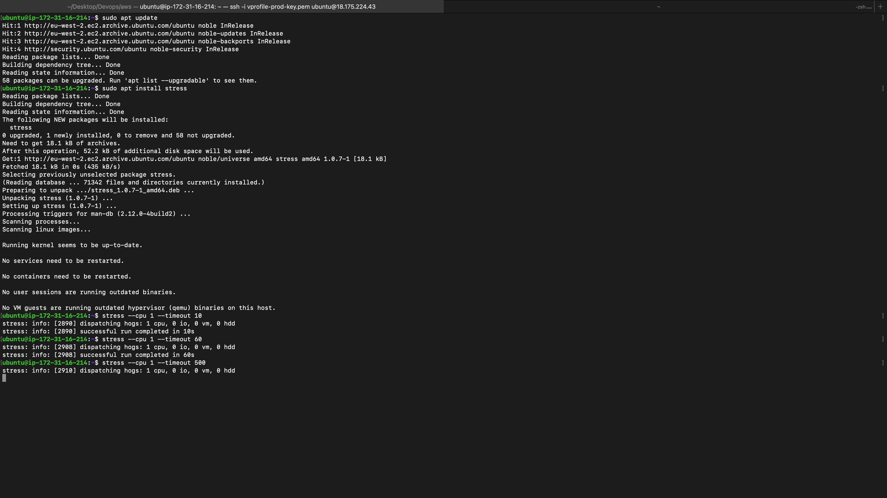
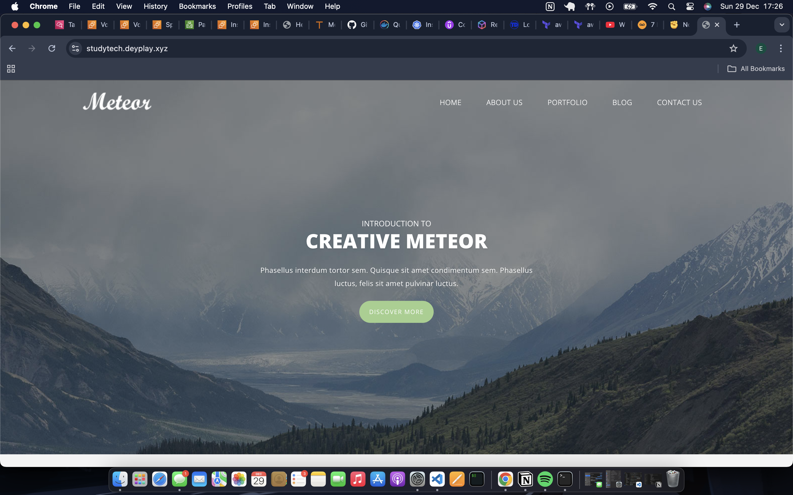

# 🚀 Auto-Scaling Web Application Infrastructure on AWS

## 🌟 Project Overview

This project demonstrates the deployment of a robust, scalable, and secure web application infrastructure on AWS using Terraform. It showcases DevOps practices in cloud infrastructure management and highlights the use of auto-scaling mechanisms to optimize application performance, resource utilization and to monitor and analyze usage of the website.

## 🏗️ Infrastructure Architecture

### 🔑 Key Components

- 🖥️ **Compute**: Auto Scaling Group managing EC2 instances for elasticity.
- 🌐 **Networking**: Default VPC with subnets for resource segregation.
- ⚖️ **Load Balancing**: Application Load Balancer (ALB) to ensure even traffic distribution.
- 📈 **Scaling**: Target Tracking Auto Scaling Policy to dynamically adjust resources.
- 📜 **Deployment**: Infrastructure as Code (IaC) with Terraform for repeatability and automation.
- 🗂️ **Logging**: Access logs from the Application Load Balancer are stored in S3 for monitoring and auditing.

## 🔍 Auto Scaling Demonstration

### ⚙️ Scaling Mechanism

The infrastructure features a dynamic auto-scaling setup that:

- 🚦 Maintains a **minimum of 1 EC2 instance** to ensure availability.
- 🔝 Scales up to **2 instances** during high demand periods.
- 🎯 Adjusts scaling based on **CPU utilization metrics** to meet application demands efficiently.

### 🚀 Scaling Trigger

- 📊 **Metric**: Average CPU Utilization.
- 🎚️ **Threshold**: 50%.
- 🔄 **Action**: Automatically launches an additional EC2 instance to handle the increased load.

## 📊 Scaling Process Walkthrough

### 🟢 Initial State


- ✅ Single t2.micro instance running.
- 📉 Low baseline CPU utilization with minimal application load.

### 🔥 CPU Stress Test



- 🛠️ Used the `stress` command to simulate high CPU load on the instance.
- 🎯 Targeted a single CPU core.
- ⏱️ **Duration**: 500 seconds.

### 📈 CloudWatch Metrics


- 🚨 CPU utilization exceeded the **50% threshold**.
- 🔄 Auto-scaling policy triggered, adding a new EC2 instance.

### 🟢 Scaled Infrastructure


- 🆕 Second EC2 instance automatically launched.
- ⚖️ Load distributed across two instances, ensuring optimal performance.

## 🟢 Website



## 🛠️ Technical Implementation

### 📦 Terraform Modules

- 🌐 **VPC**: Utilizes the default AWS VPC for simplified networking.
- 🔒 **Security Groups**: Implements access rules with least privilege.
- 📈 **Auto Scaling Group**: Manages the lifecycle of EC2 instances.
- ⚖️ **Application Load Balancer**: Distributes incoming traffic evenly.

### 🔑 Key Terraform Resources

- 🛠️ `aws_launch_template`: Defines the EC2 instance configuration.
- 🔄 `aws_autoscaling_group`: Manages the number of EC2 instances.
- 🎯 `aws_autoscaling_policy`: Implements target tracking scaling.

### 🚀 Scaling Policy Configuration

```hcl
resource "aws_autoscaling_policy" "cpu_policy" {
  policy_type = "TargetTrackingScaling"
  target_tracking_configuration {
    predefined_metric_specification {
      predefined_metric_type = "ASGAverageCPUUtilization"
    }
    target_value = 50.0
  }
}
```

## 💡 Key Learnings

- 📊 **Dynamic Scaling**: Auto-scaling ensures resources align with application demands.
- 🌐 **Cloud-Native Design**: Leverages AWS-native services for scalability and reliability.
- 🤖 **Automation**: Terraform simplifies deployment and management of infrastructure.
- ⚙️ **Performance Optimization**: Demonstrates how to optimize resource allocation based on real-time metrics.

## 🔒 Security Considerations

- 🛡️ Uses default VPC security groups with minimal access.
- 🔐 Implements the principle of least privilege for access controls.
- ✅ Monitors instance health to ensure high availability and fault tolerance.

## 🌟 Potential Improvements

- 🛠️ **Custom VPC**: Replace the default VPC with a custom VPC for enhanced isolation and control.
- 📊 **Granular Metrics**: Add additional scaling metrics for more precise resource management.
- 🚨 **CloudWatch Alarms**: Integrate alarms for proactive monitoring and alerting.
- 🌍 **Multi-Region Deployment**: Expand infrastructure to support failover and regional redundancy.

## 📋 Prerequisites

- ☁️ **AWS Account**: Required to deploy resources.
- 📜 **Terraform**: Ensure the latest version is installed.
- 🌐 **Networking Knowledge**: Basic understanding of AWS networking concepts.

## Project Structure

```
├── main.tf
├── variables.tf
├── outputs.tf
└── modules/
    ├── vpc/
    ├── security-groups/
    ├── ec2/
    └── alb/
    └── asg/
```

## 🤝 Contributions

Contributions, issues, and feature requests are welcome! Follow these steps to contribute:

1. 🍴 Fork the repository.
2. 🌱 Create a feature branch:
   ```bash
   git checkout -b feature/YourFeature
   ```
3. ✍️ Commit your changes:
   ```bash
   git commit -m 'Add YourFeature'
   ```
4. 🚀 Push the branch:
   ```bash
   git push origin feature/YourFeature
   ```
5. 📬 Submit a pull request for review.

---

> **Note**: Always consider the cost implications of running resources on AWS. Use `terraform destroy` to clean up resources when not in use.
